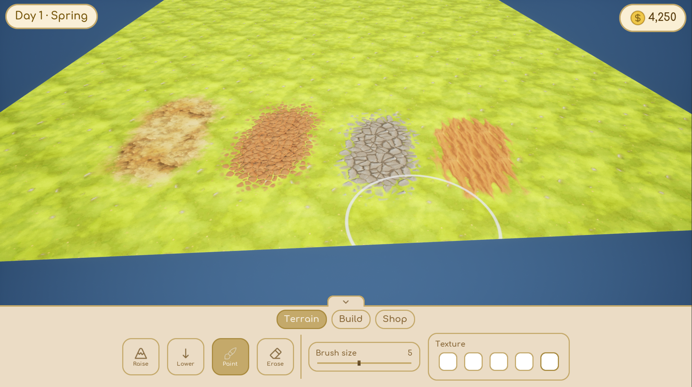
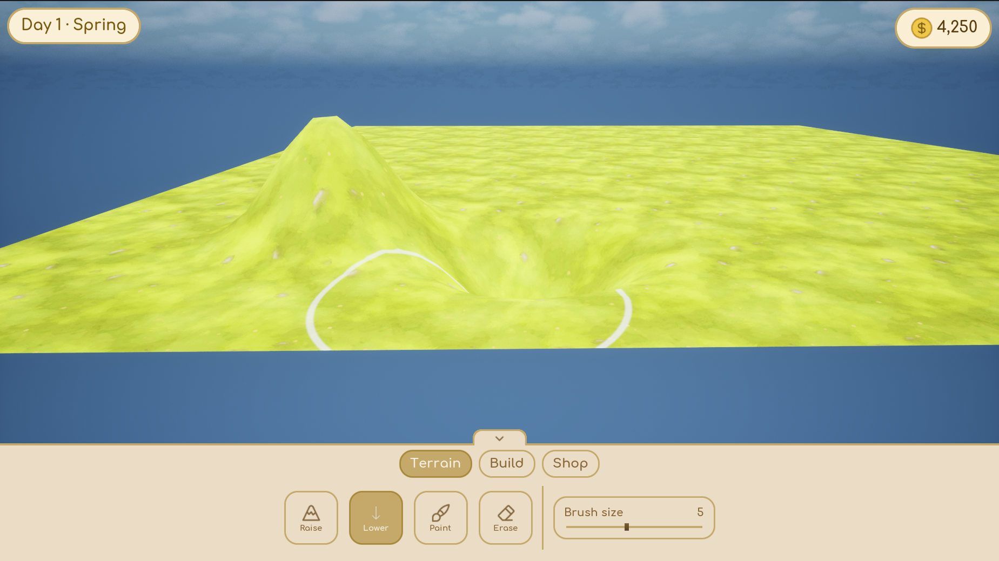
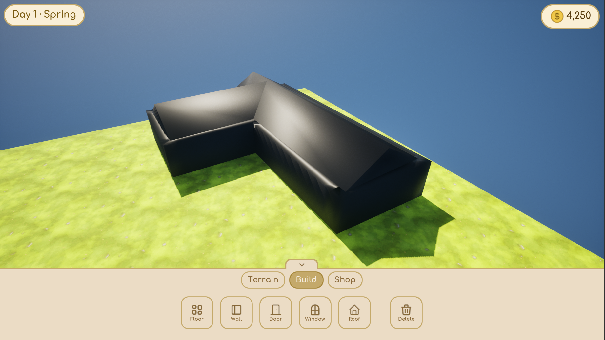
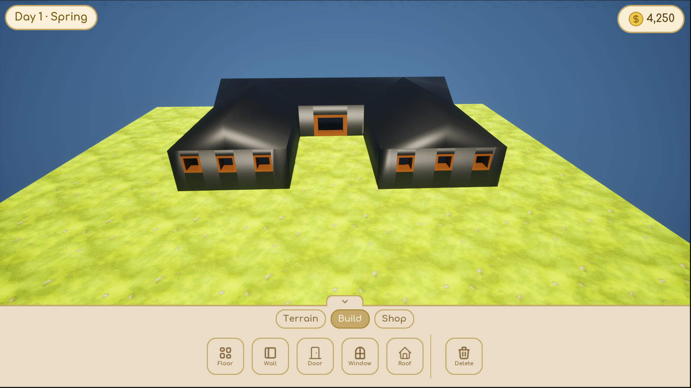

# Home Builder — Unreal Engine 5 Project

Home Builder is a procedural building game prototype developed in Unreal Engine 5, inspired by sandbox builders like *Tiny Glade*.
The focus is on **runtime procedural geometry** — you draw walls and the game generates the walls, floors, roofs, and openings as live, editable meshes.
I'm building this as the centerpiece of my programming portfolio, documenting each stage of progress.

---

## 🎮 Features

### 🏠 Procedural Building System
- **Spline-based walls** — draw a polyline and walls are generated with adjustable height and thickness
- **Live editing handles** — drag corners and segments to reshape, drag a knob to set wall height
- **Wall merging & T-junctions** — wall ends snap and merge; T-junctions are detected and stitched automatically
- **Rooms** — closed walls auto-generate a floor and roof; straight or rounded corners; corner deletion
- **Doors & windows** — openings follow the wall when edited, stack above/below each other, and hide when they no longer fit
- **Roofs** — gable roofs with connecting ridges and a convex **straight-skeleton hip roof** fallback for non-rectangular rooms; per-room roof height, selectable, draggable, and fully flat-roof capable
- **Selection system** — pick walls, openings, or roofs, each highlighted with a camera-facing dashed outline

### 🌍 Terrain Editor
- Runtime sculpting (raise / lower) on a procedural mesh
- Texture painting via vertex-color splatting (5 textures, height-blended material)

### ⚙️ Core
- Custom C++ GameMode and PlayerController
- Camera system (pan, zoom, rotate)
- Enhanced Input
- UMG-based HUD (icons, panels, tool modes)

---

## 🛠️ Technologies

- Unreal Engine 5.5.4
- C++ (gameplay, procedural mesh generation, camera, terrain, UI)
- ProceduralMeshComponent + Spline components
- Blueprints (rapid prototyping)
- UMG (user interface)
- Enhanced Input

---

## 📂 Project Structure

The repository contains only the files required to build the project:

Config/
Content/
Source/
HomeBuilder.uproject

Automatically generated folders (Binaries, Intermediate, Saved, DerivedDataCache) are ignored according to the `.gitignore`.

---

## 🗺️ Roadmap

### ✅ Done
- [x] Terrain editor (sculpt + paint)
- [x] Spline-based wall and floor building
- [x] Doors & windows with live editing
- [x] Wall merging and T-junctions
- [x] Gable and hip roofs with adjustable, selectable height

### 🎯 Short-term (polish toward a finished demo)
- [ ] Undo / redo
- [ ] Snapping feedback and cleaner handle visuals
- [ ] Lighting and material pass for presentation
- [ ] Save / load buildings

### 🚀 Long-term
- [ ] Multi-story buildings
- [ ] Interior walls and per-surface material swapping
- [ ] Code optimization and refactoring

---

## 🖼️ Media

### Demo Video
[Demo video 1](https://drive.google.com/file/d/1kjTWiadPv8AZh6xOCwodlZzc5cTshcfS/view?usp=drive_link)
[Demo video 2](https://drive.google.com/file/d/1bHlCypn5gUPXczg5S3tksHV7-VfSBjdc/view?usp=sharing)
### Screenshots

---

## 📘 Devlog

I document progress through commits and GitHub Issues.
In the future, I plan to maintain a devlog in a `/docs` folder or via GitHub Pages.

---

## 🧩 Installation & Running the Project

To open and run the project locally:

1. Clone the repository:
git clone https://github.com/AdamSzukalski/Home-Builder.git
2. Open the project folder and right-click `HomeBuilder.uproject`.
3. Select **Generate Visual Studio project files**.
4. Open the generated `.sln` file in Visual Studio or Rider.
5. Build the project (Development Editor).
6. Launch the Unreal Editor from the IDE or by double-clicking the `.uproject` file.

The project requires **Unreal Engine 5.5.4** or newer.

## 📩 Contact

If you want to see more of my projects or get in touch, feel free to visit:
**https://github.com/AdamSzukalski**
